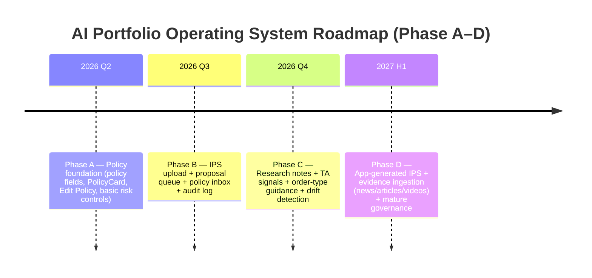

# AI-Driven Portfolio Operating System for Retail Investors

## Executive summary

An AI-driven “portfolio operating system” becomes a defensible product when it is built around a **policy layer** (an Investment Policy Statement, IPS) that can be **generated, ingested, and operationalized** as: (1) continuous risk controls, (2) explainable alerts, and (3) human-approved action proposals. This architecture directly addresses regulator-raised concerns about “digital engagement practices” that can steer retail behavior via nudges, gamification, and AI-driven personalization. citeturn15view0

A scalable system should support two primary user segments:

- **Advanced / policy-led users** who already have an IPS and need fast mapping, enforcement, and drift detection.
- **Mainstream retail traders** who don’t have an IPS and need the app to help build one via guided risk profiling, then maintain it with minimal manual overhead.

Regulatory boundaries should be treated as a design constraint, not a legal footnote. In the US, advice that is tailored to a user’s specific portfolio can implicate investment adviser status, while “publisher” style impersonal content can qualify for an exclusion if it is general, disinterested, and of regular circulation. citeturn2search3turn7search1turn7search10 In the EU, suitability expectations (MiFID II) emphasize collecting sufficient client information and not using disclaimers to shift a firm’s suitability responsibility. citeturn13view0 AI governance expectations (NIST AI RMF; EU AI Act risk-based framework) reinforce the need for auditability, transparency, and robust operational controls. citeturn1search2turn3search2turn12view0

The recommended build sequence is a four-phase roadmap:

- **Phase A:** policy fields + policy UI + core risk controls (manual policy seeding, “Edit Policy” from position page, basic alerts).
- **Phase B:** IPS upload + **proposal queue** + human approval writes (the “unlock” for scale).
- **Phase C:** institutional-style research notes + TA-assisted signals + order-type guidance + drift detection (still human-in-loop, portfolio-aware).
- **Phase D:** app-generated IPS, continuous refinement, and content ingestion at scale (news/article/video evidence pipeline), with mature governance and privacy/security hardening.

Unspecified items that materially affect architecture, cost, and compliance scope include: target user scale (hundreds vs millions), hosting region(s), whether you will integrate with brokers, and whether the product will make personalized recommendations or remain “education/decision-support.” These should be explicitly decided early because they change data retention, audit needs, and regulatory posture. citeturn7search19turn8search0turn13view0turn12view0

## User segments and product positioning

A practical segmentation that maps to both UX and compliance:

**Advanced policy-led investors (power users)**  
They already have an IPS (often in spreadsheets / docs / PDFs). They want: rapid ingestion, minimal friction mapping to accounts/positions, enforceable constraints (concentration/leverage), and drift detection. This segment benefits from features like proposal diffs, IPS versioning, and a policy inbox.

**Guided retail traders (the mass market)**  
They typically do not have a formal IPS and can be influenced by UI nudges. Regulators explicitly list retail-facing “engagement” features (badges, leaderboards, celebrations, predictive analytics and AI/ML personalization) as areas of concern, which means your product’s core differentiation can be “policy-first, risk-first, friction-when-needed” rather than “more stimulation.” citeturn15view0

**Implication for feature design**  
The same underlying data model can serve both segments by storing policy as structured fields; the difference is how it is created:

- Advanced users: IPS ingestion + proposal queue and selective manual overrides.
- Retail users: guided onboarding that generates a lightweight IPS and evolves it over time through targeted questions and behavioral drift prompts (modeled on known robo-adviser questionnaire and suitability principles). citeturn14view0turn13view0

## Onboarding flows and UI/navigation patterns

A portfolio operating system needs **three onboarding flows** that share the same backend policy schema.

**Manual seeding (Phase A)**  
Use for early adopters and “bootstrap”: user manually assigns policy to a subset of positions. This should be intentionally lightweight because SEC staff guidance on robo-advisers highlights that clients may rely heavily on online interfaces and questionnaires; dense flows reduce completion and increase misunderstanding. citeturn14view0

**IPS upload + proposal queue (Phase B)**  
This is the scalable path for policy-led users. Extract policy candidates (position bucket/action/stop/add zone/notes) from an uploaded IPS file, then present a proposal list with “approve / edit / reject” per item. The system records both the extracted values and the user’s final decision, supporting auditability and later diffing when the IPS is re-uploaded.

**App-generated IPS (Phase D)**  
For retail users, generate a baseline IPS from risk profiling. SEC robo-adviser guidance emphasizes that many robo-advisers rely solely on questionnaires and should address inconsistencies and follow-ups; your app-generated IPS flow should explicitly include inconsistency checks and clarifying questions. citeturn14view0

### Navigation primitives that keep “policy” first-class

**Position policy card as the primary policy surface**  
Policy should not be buried under “Edit Position” (which feels administrative). Instead, policy belongs on the position detail page as a readable card with an explicit edit affordance.

**Edit Policy modal for quick corrections**  
Keep it narrow: bucket/action/stop/add zone/policy note. This matches the “manual override” need even after IPS ingestion.

**Policy inbox as the operational hub (Phase B/C)**  
A dedicated screen that aggregates:
- pending proposals (from IPS upload or AI suggestions),
- missing policy fields,
- drift items (e.g., stop breached, concentration exceeded),
- conflicts (IPS vs current DB state).

### Example UI placements for the Edit Policy affordance (exact location + behavior)

**Placement and behavior (recommended default)**  
- Location: **Position detail header card, top-right policy cluster** (same column as bucket/action badges).
- If policy exists (bucket or action set): show badges plus a **small pencil icon** below/right aligned; tap opens Edit Policy modal.
- If policy is empty: show a faint **“+ Add Policy”** link in the same corner; tap opens the same modal with blank/default fields.
- Save behavior: on save, the position detail view refreshes and badges/stop/add-zone rows update immediately (invalidate/refetch positions query).

This placement reinforces the mental model: “policy is part of understanding the position,” not buried metadata. It also reduces the number of taps and aligns with best practice from robo-adviser disclosure guidance: key information should be accessible and not buried. citeturn14view0

## Data model and minimal schema evolution

A minimal viable policy schema should distinguish between **canonical state** (the truth used for alerts and UI) and **proposed changes** (AI/IPS suggestions awaiting approval). This separation is essential for governance: NIST AI RMF treats trustworthy AI as a lifecycle discipline where transparency and risk management require measurable controls and documented processes. citeturn1search2

### Minimal policy entities

- **User**
- **Portfolio** (a user can have multiple)
- **Account** (brokerage account, wallet, etc.)
- **Position** (holding-level record)
- **PortfolioPolicy** (portfolio-level IPS: risk limits, objectives, defaults, version)

### Proposal queue entities (Phase B)

- **PolicySourceDocument**  
  Metadata + extracted text (or references) for IPS uploads. Keep immutable: hash, upload timestamp, extraction method.
- **PolicyProposal**  
  A batch representing one parsing run (e.g., “IPS v4.8 upload on date X”).
- **PolicyProposalItem**  
  One proposed change targeting a specific entity (portfolio/account/position) with:
  - proposed structured fields (or JSON Patch against canonical state),
  - confidence + rationale,
  - extracted evidence snippets (limited length) + provenance,
  - user decision status (pending/approved/rejected/edited).

### Minimal schema changes approach

To keep early phases low-risk, avoid modeling every possible rule up front. Start with:
- position-level: bucket, action, stop, add zone, cut-list date, policy note, IPS version
- account-level: sleeve key, max leverage, IPS version
- portfolio-level: defaults and constraints (max position size %, max leverage, sector caps)

Then add new tables only when the workflow demands them (proposal queue, content ingestion, research caches).

## API and DB write patterns for human-approved governance

A robust write pattern is:

1. **AI/IPS parsing produces proposals only**  
   Writes go to `policy_proposal` / `policy_proposal_item`, not to canonical tables.
2. **User approves (or edits) proposal items**  
   Approval triggers a transactional write:
   - update canonical policy fields (position/account/portfolio_policy),
   - write an immutable audit event (who approved, when, what changed, why),
   - mark proposal item resolved.
3. **All automated suggestions remain reviewable**  
   This creates defensible auditability and supports re-running ingestion without corrupting policy state.

This pattern aligns with the strongest practical interpretation of NIST AI RMF guidance: manage AI risk by ensuring clear accountability and measurable controls rather than silent automation. citeturn1search2

A compliance-driven advantage: it also reduces the chance your system “acts like an adviser” by automatically implementing personalized recommendations without user agency (even though the actual legal boundary depends on jurisdiction and business model).

## Core feature set and decision engine design

A portfolio operating system should treat “analysis” (fundamentals, technicals, content) as inputs to a **policy-driven decision engine**, not as independent chat outputs.

### Risk profiling and IPS generation

SEC guidance on robo-advisers emphasizes three themes directly applicable to your onboarding design:
- Many platforms rely primarily or solely on questionnaires;
- Inconsistencies should be flagged and followed up;
- The interface should make key disclosures readable and not buried. citeturn14view0

ESMA’s MiFID II suitability guidance emphasizes:
- clients should be informed about the purpose of suitability assessment;
- information must be accurate, up-to-date, complete;
- disclaimers cannot shift suitability responsibility. citeturn13view0

Even if you are not a regulated adviser, these are strong product quality standards for risk profiling. A retail IPS generator should produce:
- objectives/time horizon,
- risk capacity and willingness,
- leverage permissions/limits,
- concentration limits and diversification preferences,
- sell discipline (exit rules),
- review cadence.

### Policy-driven controls: concentration, leverage, and drift

**Leverage and margin risk surfaces**  
Investor.gov bulletins explain how leveraged strategies (margin, options, leveraged ETFs) can magnify both gains and losses; they are framed as “advanced tools” requiring risk awareness. citeturn6search1turn6search9turn6search5  
Therefore the core OS should:
- calculate effective leverage exposure (gross and net),
- enforce account-level max leverage rules,
- warn when the user moves toward margin call risk (where applicable).

**Concentration controls**  
Concentration limits should be expressed as policy constraints:
- max position % of portfolio,
- max sector/industry %,
- max correlated exposure (later phase).

**Drift detection**  
Drift = policy no longer matches reality:
- position exceeds max size due to price appreciation,
- stop breached,
- add-zone invalidated,
- policy version stale vs latest IPS.

### Institutional-style fundamentals without false authority

The research module should anchor on primary financial statement concepts. SEC’s investor education explains the four core statements and their purpose (balance sheet, income statement, cash flow, equity changes). citeturn6search3  
It should also treat “free cash flow” as a non-GAAP metric with variability in definition; SEC staff guidance warns non-GAAP measures can be misleading if presented improperly. citeturn6search2

The strongest “institutional-style” differentiation is not tone; it is:
- explicit provenance (filings/dates used),
- explicit assumptions (peer set, segment estimates),
- explicit uncertainty (what is inferred vs sourced),
- portfolio-fit overlay (how this changes the user’s concentration/risk).

### Technical analysis and TA-assisted trade suggestions

Academic work has attempted to formalize pattern recognition and evaluate its effectiveness. Lo, Mamaysky, and Wang propose systematic pattern recognition using statistical methods to evaluate technical analysis across many US stocks historically. citeturn9search0turn9search12  
Commercial platforms also provide automated pattern detection as a feature category, which supports user demand (even when predictive power varies). citeturn9search14turn9search18

A robust TA module should produce:
- detected pattern + timeframe + confidence (clearly labeled as “signal,” not certainty),
- invalidation level (where your thesis breaks),
- risk/reward framing,
- fit-to-policy checks (e.g., “this trade increases sector concentration beyond your cap”).

### Order-type guidance linked to risk and market mechanics

Order-type education should be embedded in the decision flow, not hidden. Investor.gov explains that:
- a stop order becomes a market order once triggered,
- stop-limit orders may not execute in fast markets as price moves away. citeturn6search0turn6search4turn6search8

This matters because “trade suggestions” that omit execution mechanics can increase slippage risk and user harm. A policy-aware system should recommend order types conditionally:
- if liquidity is low or volatility high, prefer limit or staged execution,
- if exit discipline is critical, explain stop vs stop-limit tradeoffs.

## Content ingestion from news/articles/videos and rights constraints

A differentiated feature is “bring your own evidence”: the user supplies a link or text, and the system turns it into:
- extracted claims,
- affected tickers/industries,
- scenario impact on policy and existing positions,
- follow-up questions where uncertainty remains.

### YouTube ingestion: avoid scraping; comply with platform rules

YouTube’s Terms of Service explicitly restrict automated access (robots/scrapers) except under narrow conditions (e.g., public search engines, prior written permission, or as permitted by law). citeturn17view0  
If you build video ingestion, the compliant approach is to use the YouTube API under its Terms of Service and Developer Policies, which emphasize:
- compliance with the Agreement and documented access methods,
- monitoring/auditing rights,
- prohibitions on accessing data through undocumented means or other technologies. citeturn19view0turn18view0

Practical architecture for video ingestion:
- store the URL and metadata,
- fetch public metadata via API where permitted,
- obtain transcripts via approved mechanisms (e.g., captions APIs when authorized/available) or accept user-provided transcript text,
- produce summaries and claim extraction with provenance pointers.

### Summarization and copyright constraints

Copyright risk does not disappear because the user provided a link. A safe product posture is:
- store references (URL + metadata) by default,
- store only minimal excerpting necessary for evidence tracking,
- keep user-provided text under consent and clear retention rules.

The US Copyright Office’s Fair Use Index is a practical starting point to understand how courts evaluate fair use factors case-by-case, but it does not create a blanket right to copy content. citeturn5search3  
Accordingly, the product should implement:
- a rights-aware ingestion policy (what is stored vs referenced),
- retention controls (delete on user request),
- user-facing provenance (“this summary is derived from X link provided by you”).

## Compliance constraints, AI governance, and privacy/security

### US regulatory boundaries

**Investment adviser definition and “publisher” exclusion**  
US law defines an “investment adviser” broadly as someone advising others for compensation about securities or issuing analyses/reports. citeturn2search3  
SEC staff discussion of the publisher exclusion describes three criteria: advice must be impersonal (not adapted to specific portfolios), bona fide (disinterested commentary), and of general and regular circulation (not timed to market events). citeturn7search1  
The Supreme Court’s Lowe decision is a key precedent interpreting the publisher exclusion around impersonal newsletter-style advice. citeturn7search10

Design implication: if your app provides **portfolio-tailored buy/sell recommendations**, you should assume you are closer to “advice” than “publishing,” and you should consult counsel on registration/exemptions and operational requirements. If you keep outputs more impersonal and focus on education and user-controlled policy constraints, you reduce—but do not eliminate—advice risk.

**Broker-dealer recommendations (Reg BI)**  
SEC’s Regulation Best Interest establishes a “best interest” standard for broker-dealers when making recommendations to retail customers. citeturn8search0  
If you integrate with brokers or distribute recommendations under a broker-dealer umbrella, Reg BI framing becomes relevant to disclosure, conflicts, and care obligations described in the release. citeturn8search0

**Communications and “research report” framing (FINRA)**  
entity["organization","FINRA","us broker-dealer self-regulator"] Rule 2241 defines a “research report” as a written communication with analysis providing information reasonably sufficient to base an investment decision, and it is centered on conflict management and disclosures for member firms. citeturn0search3turn0search7  
Rule 2210 governs communications with the public, requiring content standards and supervisory processes for member firms. citeturn0search2turn8search2  
Even if you are not a FINRA member, these rules are informative: they show why “institutional-style notes” must avoid misleading claims and why provenance/conflict disclosures matter if you commercialize research-like outputs.

### EU regulatory boundaries and AI governance

**MiFID II suitability and robo-advice expectations**  
entity["organization","European Securities and Markets Authority","eu securities regulator esma"] guidelines clarify application of MiFID II suitability requirements for investment advice/portfolio management and emphasize clear client information, completeness, and that disclaimers do not shift responsibility. citeturn13view0  
They also define “robo-advice” as (semi)automated client-facing tools for investment advice or portfolio management. citeturn13view0

**EU AI Act**  
entity["organization","European Commission","eu executive body"] summarizes the AI Act as Regulation (EU) 2024/1689 and frames it as a risk-based legal framework aiming at trustworthy AI. citeturn3search2  
entity["organization","European Parliament","eu legislature"] documentation highlights staged application and a risk-based classification approach, including transparency obligations for certain AI systems and additional governance structures. citeturn12view0  
For a finance-adjacent AI product, the main practical impact is that you should design for transparency, risk controls, and documentation from the start—especially if you expand into automated decisioning that could be considered high-impact.

### AI governance and auditability

entity["organization","National Institute of Standards and Technology","us standards agency nist"] AI RMF 1.0 is a lifecycle framework for mapping, measuring, and managing AI risks, emphasizing that AI is socio-technical and that trustworthy operation depends on how systems are built and used. citeturn1search2  
In your product, “trustworthy AI” should be implemented as:
- proposal queue + approvals (human-in-loop),
- provenance for outputs (sources, timestamps),
- model/version logging for generated artifacts,
- monitoring for drift and failure modes (bad suggestions, hallucinated citations).

### Privacy and security

NIST Privacy Framework provides risk-based structure for identifying and managing privacy risks in products and services. citeturn1search3turn1search11  
If you operate as (or partner with) a covered financial institution, SEC Regulation S-P becomes directly relevant to safeguarding customer information and privacy expectations. citeturn7search2turn7search19

Practical privacy/security requirements for this product category:
- data minimization by default (store references over full content where possible),
- encryption in transit and at rest,
- strict access controls (least privilege),
- audit logs for policy changes and AI-generated proposals,
- clear retention and deletion controls for user-supplied documents and transcripts.

## Phased roadmap with acceptance criteria, engineering effort, and risks

### Phase A–D comparison table

| Phase | Minimal viable deliverables | Acceptance criteria (examples) | Likely impacted files/components (illustrative) | Effort | Key risks |
|---|---|---|---|---|---|
| Phase A: Policy foundation | Structured policy fields on positions/accounts; position policy card; Edit Policy modal; basic risk controls (concentration/leverage); alerts UI | User can change policy from position page in ≤2 taps; alerts trigger on clear thresholds; policy values persist and survive reload | Mobile: Position detail screen, PolicyCard, EditPolicyModal; API: /positions update; DB: add policy columns + portfolio_policy table | Low–Med | Policy UI buried or unused; scope creep into “full IPS management” too early; unclear separation between “edit position” vs “edit policy” |
| Phase B: IPS ingest + proposal queue | IPS upload/paste; parser creates proposals; policy inbox to review; approve/edit/reject writes to canonical tables; audit log | Upload produces proposals for ≥80% of holdings; approvals are transactional and reversible via audit; re-upload produces diff view (no silent overwrite) | API: /ips/upload, /policy/proposals, /policy/approve; Worker: document extraction; DB: policy_proposal tables; UI: PolicyInbox, ProposalReview | Med–High | Parsing quality; PDF extraction variability; user trust if proposals lack provenance; operational complexity (jobs, storage) |
| Phase C: Research + TA + drift detection | Institutional-style research notes with provenance; TA pattern detection module; order-type guidance; drift detection (stops, concentration, stale policy) | Research notes cite sources/dates; TA signals show invalidation and confidence; drift inbox surfaces top risks daily; no auto-trades | API: /research/:symbol, /ta/:symbol; DB: optional caches; UI: ResearchNoteView, SignalCards, DriftInbox; Risk engine job | High | Advice boundary creep (personal recommendations); misleading certainty; data licensing; performance/cost of analytics |
| Phase D: App-generated IPS + content ingestion OS | Guided IPS builder; ongoing questions; ingest links/videos with rights-aware pipeline; evidence-to-decision trace; mature governance | New user can onboard to a baseline IPS in <10 minutes; content ingestion produces ticker impact + policy implications; governance logs complete; privacy controls verified | UI: OnboardingWizard, EvidenceInbox; API: /evidence, /claims, /policy/refine; DB: content tables; governance services | High | Regulatory posture changes materially; privacy/security risk increases; platform ToS violations if ingestion is not compliant; scaling costs |

Notes: “Likely impacted files/components” are intentionally illustrative because you did not specify the final tech stack. If you are building on a React Native + Node + Postgres stack (as your current prototype suggests), map these to your existing screens/components and API routes accordingly. citeturn14view0turn15view0

### Mermaid timeline for the roadmap



### Phase-specific risks and mitigations (cross-cutting)

**Advice boundary creep**  
Mitigation: keep “suggestions” in proposal form; never auto-write to canonical policy; label outputs as decision-support; make user approval explicit; align UI language with the “information vs recommendation” boundary described in UK FCA guidance. citeturn2search6turn2search14turn7search1

**DEP-like dark patterns**  
Mitigation: design contrary to gamification patterns highlighted by the SEC; introduce friction where risk is high (leverage, high volatility, options). citeturn15view0

**Content rights compliance**  
Mitigation: don’t scrape; comply with YouTube ToS and YouTube API policies; prefer storing URLs and user-provided excerpts/transcripts. citeturn17view0turn19view0turn18view0

## Recommended prompt templates

### IPS parsing prompt template (IPS upload → proposal queue)

Use this to transform an IPS document into structured proposal items without writing directly to canonical tables.

```text
System:
You are an assistant helping map an Investment Policy Statement (IPS) into structured portfolio policy fields.
Do NOT write to any database. Output proposals only.
You must preserve provenance: for every extracted value, cite the exact source snippet (<= 240 chars) and its location (page/section).

User context:
- Portfolio has accounts and positions with symbols already known.
- Policy fields available:
  PortfolioPolicy: objectives, maxPositionPct, maxSectorPct, maxLeverageRatio, defaultHoldPeriodDays, ipsVersion
  AccountPolicy: sleeveKey, maxLeverageRatio, ipsVersion
  PositionPolicy: positionBucket, ipsAction, stopPrice, addZoneLow, addZoneHigh, cutListAddedAt, policyNote, ipsVersion

Input:
1) IPS text (verbatim or extracted)
2) Current portfolio positions list: [{symbol, accountName, assetType}]
3) Optional: IPS vocabulary mapping (e.g., “core”, “swing”, “cut list”)

Task:
- Extract policy candidates for portfolio/account/position.
- Match candidates to the portfolio positions list by ticker/symbol (and note unmatched items).
- For each matched item, produce a PolicyProposalItem:
  - entityType: portfolio | account | position
  - entityKey: (portfolioId|accountName|symbol+accountName)
  - proposedFields: {field: value|null}
  - confidence: 0–1
  - rationale: short explanation
  - evidence: [{snippet, location}]
  - conflicts: describe if IPS conflicts with existing stored policy fields (if provided)
  - questions: ask only if needed to resolve ambiguity

Output format:
Return JSON:
{
  "ipsVersion": "...",
  "proposals": [ ...PolicyProposalItem... ],
  "unmatched": [ ... ],
  "globalQuestions": [ ... ]
}

Constraints:
- Never infer a stop/add zone price if the IPS does not specify it; instead ask a targeted question.
- If multiple entries exist for the same symbol, propose the most conservative action and flag a conflict.
- Keep policy notes short and operational (1–2 sentences).
```

Why this works: it forces provenance, avoids silent inference, and produces reviewable proposal artifacts suitable for a human approval flow, consistent with auditability expectations. citeturn1search2turn14view0

### Institutional-style research note prompt template (avoid impersonation)

This template produces a credible “sell-side-style” note without pretending to be a specific bank or person, and it forces provenance and non-GAAP clarity.

```text
System:
Write an institutional-style equity research note for educational/decision-support purposes.
Do NOT claim affiliation with any bank or broker.
Be explicit about data provenance and freshness. If a metric depends on external data you do not have, say so.

Input:
- Ticker:
- Company name:
- As-of date:
- Financial statement data (5 years), if provided
- Segment revenue data, if provided
- Peer set list, if provided
- User portfolio context (optional): position size %, sector exposure %, policy constraints

Required structure:
1) Summary box (rating: Buy/Hold/Avoid; thesis in 2–3 bullets; key risks in 2 bullets; catalysts)
2) Business model (plain-English)
3) Segment economics (revenue mix, growth, margins where available)
4) Profitability (5-year trends: gross/operating/net margins; explain drivers)
5) Balance sheet and liquidity (debt structure, maturity concerns if known)
6) Cash flow and capital allocation
   - Clearly define free cash flow (FCF) and reconcile to operating cash flow and capex
   - Note that FCF is non-GAAP and definitions vary; do not overclaim “residual cash”
7) Competitive positioning (moat vectors scored 1–10: switching costs, network effects, brand, scale)
8) Valuation snapshot (P/E, EV/EBITDA, P/S vs history and peers—state data source or “not available”)
9) Scenario analysis
   - Bull/base/bear with explicit assumptions and ranges (not single-point certainty)
   - Provide “what would change my mind” triggers
10) Portfolio fit overlay (if portfolio context provided)
    - concentration impact, policy conflicts, risk controls
11) Disclosures & limitations
    - data sources used, missing data, and uncertainty

Style constraints:
- Avoid hype and certainty language (“guaranteed”, “will”).
- Use probabilities or ranges for forecasts; explain assumptions.
- Include citations to provided filings/inputs; otherwise mark as “needs sourcing.”

Output:
A single cohesive note in markdown.
```

This structure aligns with: (a) investor education expectations around statements and non-GAAP caution, and (b) communications standards that discourage misleading certainty. citeturn6search3turn6search2turn0search2turn0search3